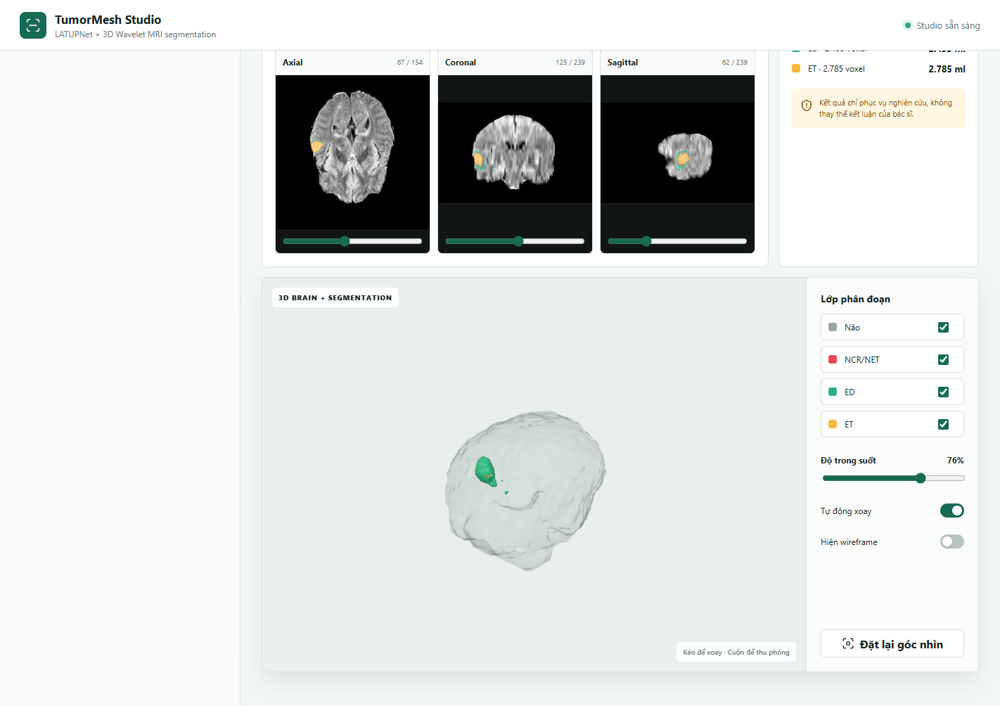
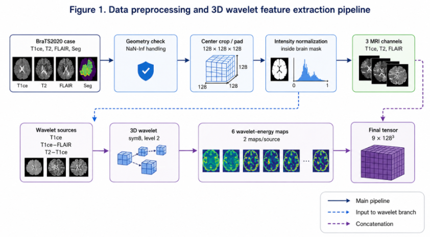
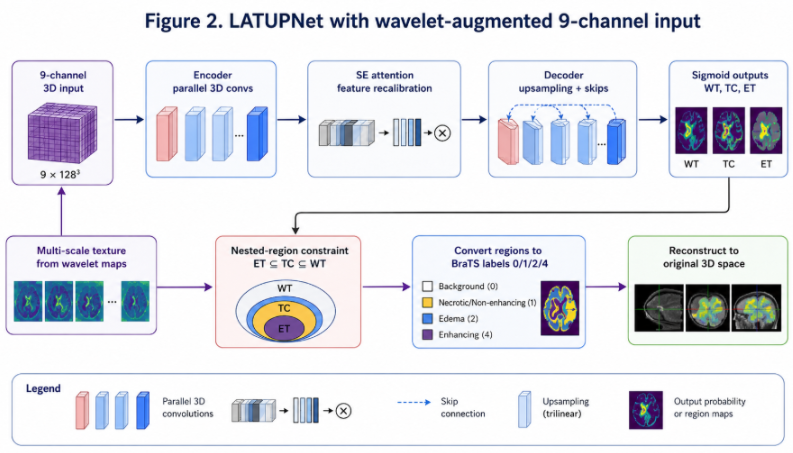

# TumorMesh Studio

**Wavelet augmented LATUPNet for 3D brain tumor segmentation and interactive reconstruction**

<p align="center">
  
</p>

TumorMesh Studio là ứng dụng web chạy cục bộ để phân đoạn u thần kinh đệm từ ba chuỗi MRI `T1ce`, `T2` và `FLAIR`. Backend dùng checkpoint LATUPNet đã huấn luyện với sáu đặc trưng wavelet 3D; frontend cung cấp lát cắt 2D theo ba mặt phẳng, thống kê thể tích, mô hình 3D tương tác và file segmentation NIfTI.

> **Research use only.** Kết quả của ứng dụng chỉ phục vụ nghiên cứu và minh họa kỹ thuật. Đây không phải thiết bị y tế, không được dùng để tự chẩn đoán hoặc thay thế đánh giá của bác sĩ.

## Chức năng chính

- Nhận ba volume NIfTI: `T1ce`, `T2`, `FLAIR` (`.nii` hoặc `.nii.gz`).
- Kiểm tra shape, affine và voxel spacing trước inference.
- Tiền xử lý đúng contract của lần huấn luyện: resample, center crop/pad, percentile clipping, masked Min-Max và wavelet 3D.
- Chạy LATUPNet với tensor đầu vào `9 x 128 x 128 x 128`.
- Xuất ba vùng BraTS lồng nhau: whole tumor (`WT`), tumor core (`TC`) và enhancing tumor (`ET`).
- Chuyển các vùng sang nhãn BraTS `{0, 1, 2, 4}`.
- Hiển thị overlay trên FLAIR ở ba mặt phẳng axial, coronal và sagittal.
- Dựng brain mesh và từng vùng u bằng marching cubes để xem bằng Three.js.
- Báo thể tích từng lớp, tỷ lệ u/não, voxel ngoài não và độ tin cậy trung bình.
- Tải kết quả về dưới dạng `pred_<case_name>.nii.gz` với shape, affine và header của T1ce gốc.

## Input và output

### Input bắt buộc

| Trường | Ý nghĩa | Yêu cầu |
|---|---|---|
| `T1ce` | T1 có tiêm chất tương phản | Volume 3D đã skull strip |
| `T2` | T2 weighted MRI | Cùng không gian với T1ce |
| `FLAIR` | Fluid Attenuated Inversion Recovery | Cùng shape, affine và spacing |

Dữ liệu phù hợp nhất là MRI theo định dạng BraTS: ba modality đã đồng đăng ký, đã loại hộp sọ và nền ngoài não bằng `0`. Tên file có thể tùy ý vì từng file được chọn vào đúng ô modality trên giao diện.

### Nhãn segmentation đầu ra

| Nhãn | Vùng | Màu trong Studio |
|---:|---|---|
| `0` | Background / non tumor | Trong suốt |
| `1` | NCR/NET: necrotic and non enhancing tumor core | Đỏ |
| `2` | ED: peritumoral edema | Xanh lá |
| `4` | ET: enhancing tumor | Vàng |

Các vùng đánh giá BraTS được suy ra như sau:

- `WT = {1, 2, 4}`
- `TC = {1, 4}`
- `ET = {4}`

## Luồng xử lý

<p align="center">
  
</p>

### 1. Kiểm tra hình học

Backend nạp ba NIfTI bằng NiBabel và từ chối input khi:

- một file không phải volume 3D;
- ba modality không cùng shape;
- affine của T2 hoặc FLAIR không khớp T1ce;
- voxel spacing không khớp giữa các modality.

### 2. Chuẩn hóa không gian

Nếu spacing chưa phải `1 x 1 x 1 mm`, MRI được resample bằng nội suy trilinear. Sau đó mỗi volume được center crop hoặc zero pad thành `128 x 128 x 128`. Metadata của phép biến đổi được giữ lại để đưa prediction về đúng không gian gốc.

### 3. Chuẩn hóa cường độ

Brain mask được tạo bằng hợp của các voxel dương trên ba modality. Mỗi modality được xử lý độc lập:

1. thay `NaN` và `Inf` bằng `0`;
2. clip cường độ trong brain mask theo percentile `P1-P99`;
3. Min-Max về `[0, 1]` chỉ trên voxel thuộc brain mask;
4. khóa toàn bộ background ngoài não ở `0`.

### 4. Đặc trưng wavelet 3D

Ba source map được sử dụng:

1. `T1ce`;
2. `T1ce - FLAIR`;
3. `T2 - T1ce`.

Mỗi source map đi qua `PyWavelets.wavedecn` với Symlet-8, level 2 và symmetric padding. Ở mỗi level, bảy detail subband 3D được tổng hợp thành một energy map:

```text
energy = sqrt(sum(abs(detail_subband)^2) + epsilon)
```

Hai level tạo hai energy map cho mỗi source, tức sáu kênh wavelet. Sáu kênh này được ghép với ba MRI đã chuẩn hóa để tạo input cuối:

```text
[T1ce, T2, FLAIR, wavelet_1, ..., wavelet_6]
shape = (9, 128, 128, 128)
```

## Kiến trúc LATUPNet

<p align="center">
  
</p>

Mô hình có `2,993,539` tham số trainable và gồm:

- parallel convolution stem với các nhánh `1 x 1 x 1`, `3 x 3 x 3` và `5 x 5 x 5`;
- encoder-decoder 3D với skip connections;
- InstanceNorm3d, LeakyReLU và Dropout3d;
- squeeze-and-excitation attention trong encoder, bottleneck và decoder;
- output head `1 x 1 x 1` trả ba logits cho `WT`, `TC`, `ET`.

Sau sigmoid, mỗi vùng dùng threshold `0.5`. Backend cưỡng chế quan hệ giải phẫu:

```text
ET subset TC subset WT
```

Nhãn cuối được khôi phục theo thứ tự `WT -> ED`, `TC -> NCR/NET`, `ET -> ET`, sau đó xóa mọi prediction ngoài brain mask. Không dùng connected component filtering để tránh loại bỏ các ổ u nhỏ hợp lệ.

## Dựng mô hình 3D

Phần 3D được chia giữa backend Python và frontend JavaScript.

### Backend

1. Tạo brain mask trong không gian NIfTI gốc từ hợp voxel dương của ba MRI.
2. Tạo binary mask riêng cho nhãn `1`, `2` và `4`.
3. Gọi `skimage.measure.marching_cubes` ở iso level `0.5`.
4. Dùng `step_size=4` cho não để giảm payload; dùng `step_size=1` cho u để giữ chi tiết.
5. Áp dụng voxel spacing để vertex nằm trong tọa độ vật lý.
6. Căn mesh về tâm, chuẩn hóa scale và gửi vertices/faces dưới dạng JSON.

### Frontend

Three.js chuyển dữ liệu sang `BufferGeometry`, tính vertex normals và render bằng WebGL. Brain mesh có màu xám bán trong suốt; NCR/NET, ED và ET dùng đúng bảng màu segmentation. Giao diện hỗ trợ:

- xoay, pan và zoom bằng OrbitControls;
- bật/tắt từng lớp;
- chỉnh opacity vùng u;
- wireframe;
- auto rotate;
- reset camera.

Mesh chỉ được tải sau khi output 2D đã hiển thị, nhờ đó giao diện phản hồi sớm hơn trong khi backend dựng bề mặt 3D.

## Kết quả checkpoint đi kèm

Checkpoint phát hành được chọn tại epoch `77` theo validation mean Dice. Thí nghiệm dùng một patient level holdout trên `368` ca BraTS 2020 được phát hiện: `295` ca train và `73` ca internal validation, seed `42`.

| Metric | Mean | Standard deviation |
|---|---:|---:|
| Dice WT | 0.91506 | 0.05448 |
| Dice TC | 0.87739 | 0.12355 |
| Dice ET | 0.74664 | 0.25224 |
| HD95 WT | 4.72348 mm | 7.49062 mm |
| HD95 TC | 5.13343 mm | 6.82429 mm |
| HD95 ET | 4.34006 mm | 7.23896 mm |

Validation loss tại checkpoint là `0.17353`; mean Dice theo ba vùng là `0.84636`. Đây là kết quả internal holdout, không phải K-fold, external validation hay đánh giá lâm sàng. ET có độ biến thiên cao và vẫn là vùng khó nhất.

## Cấu trúc phần Studio

```text
.
|-- webapp/
|   |-- app.py                 # FastAPI routes và quản lý phiên
|   |-- inference.py           # preprocessing, inference, NIfTI, 2D và mesh
|   |-- model.py               # kiến trúc LATUPNet 9 kênh / 3 vùng
|   `-- static/
|       |-- index.html
|       |-- styles.css
|       |-- app.js
|       `-- vendor/            # Three.js và OrbitControls cục bộ
|-- outputs/
|   `-- best_latupnet_wavelet_region3_sigmoid_priority1.pth
|-- tests/
|   `-- test_inference.py
|-- docs/images/
|-- requirements.txt
`-- run_app.ps1
```

Checkpoint trong repository là bản deployment: giữ nguyên model weights của best checkpoint và chỉ giữ metadata cần cho inference. Optimizer state, scheduler state, lịch sử train và đường dẫn máy cá nhân không được đưa vào bản phát hành.

## Cài đặt

### Yêu cầu

- Python `3.10` hoặc `3.11`;
- RAM tối thiểu khoảng `8 GB`, khuyến nghị `16 GB`;
- GPU NVIDIA tương thích CUDA được khuyến nghị;
- CPU vẫn chạy được nhưng inference wavelet và mô hình 3D sẽ chậm hơn đáng kể.

### Windows PowerShell

```powershell
git clone https://github.com/GauKho/3D-Brain-Tumor-Reconstruction-and-Segmentation.git
cd 3D-Brain-Tumor-Reconstruction-and-Segmentation

py -3.11 -m venv .venv
.\.venv\Scripts\Activate.ps1
python -m pip install --upgrade pip
pip install -r requirements.txt
```

Nếu PowerShell chặn script kích hoạt, chạy một lần trong terminal hiện tại:

```powershell
Set-ExecutionPolicy -Scope Process Bypass
.\.venv\Scripts\Activate.ps1
```

Để dùng GPU, cài đúng PyTorch build tương ứng CUDA của máy trước khi cài phần còn lại. Có thể kiểm tra sau khi cài:

```powershell
python -c "import torch; print(torch.__version__); print(torch.cuda.is_available())"
```

### Linux hoặc macOS

```bash
git clone https://github.com/GauKho/3D-Brain-Tumor-Reconstruction-and-Segmentation.git
cd 3D-Brain-Tumor-Reconstruction-and-Segmentation

python3 -m venv .venv
source .venv/bin/activate
python -m pip install --upgrade pip
pip install -r requirements.txt
```

## Chạy TumorMesh Studio

### Windows

```powershell
.\run_app.ps1
```

Script kiểm tra các port từ `8000` đến `8010`. Nếu port `8000` đang bận, Studio tự chọn port tiếp theo và in URL chính xác ra terminal.

Có thể chọn port bắt đầu khác:

```powershell
.\run_app.ps1 -Port 8080
```

### Chạy trực tiếp trên mọi hệ điều hành

```bash
python -m uvicorn webapp.app:app --host 127.0.0.1 --port 8000
```

Mở [http://127.0.0.1:8000](http://127.0.0.1:8000). Không mở trực tiếp `index.html`, vì giao diện cần FastAPI phục vụ API và static assets.

## Cách sử dụng

1. Chọn đúng file `T1ce`, `T2` và `FLAIR`.
2. Chờ backend kiểm tra và hiển thị preview của ba volume.
3. Dùng slider để kiểm tra các lát MRI trước inference.
4. Nhấn **Tiến hành chẩn đoán**.
5. Xem thống kê và overlay FLAIR theo axial, coronal, sagittal.
6. Kiểm tra mô hình 3D và bật/tắt từng vùng.
7. Tải prediction NIfTI về máy.

Ca mẫu không được đưa vào repository để tránh phát hành dữ liệu MRI không cần thiết. Nút ca mẫu chỉ hoạt động nếu người dùng tự đặt một thư mục mẫu tương thích tại vị trí được cấu hình trong `webapp/app.py`.

## REST API

| Method | Endpoint | Chức năng |
|---|---|---|
| `GET` | `/api/status` | Trạng thái checkpoint và ca mẫu |
| `POST` | `/api/cases` | Upload multipart `t1ce`, `t2`, `flair` |
| `GET` | `/api/cases/{id}/slice?index=n` | Preview ba modality tại một lát |
| `POST` | `/api/cases/{id}/diagnose` | Chạy preprocessing và inference |
| `GET` | `/api/cases/{id}/result-slice?axis=axial&index=n` | Overlay FLAIR và segmentation |
| `GET` | `/api/cases/{id}/mesh` | Brain/tumor vertices và faces |
| `GET` | `/api/cases/{id}/prediction` | Tải NIfTI prediction |
| `POST` | `/api/sample` | Nạp ca mẫu cục bộ nếu có |

Mỗi file upload được giới hạn `160 MB`. Server chỉ giữ tối đa hai ca gần nhất trong bộ nhớ của một process. File tạm và prediction nằm trong `runtime/cases/` và bị Git bỏ qua.

## Kiểm thử

```bash
python -m unittest discover -s tests -v
```

Test suite kiểm tra:

- crop/pad và inverse transform;
- masked normalization và background bằng `0`;
- tensor preprocessing đủ `9` kênh;
- quan hệ vùng `ET subset TC subset WT`;
- checkpoint nhận `9` kênh và trả `3` region logits;
- nhãn NIfTI hợp lệ `{0,1,2,4}` khi có regression sample cục bộ.

## Xử lý lỗi thường gặp

### `Errno 10048` hoặc port đã được sử dụng

Dùng `run_app.ps1`; script sẽ tìm port trống. Nếu chạy uvicorn thủ công, đổi sang port khác:

```bash
python -m uvicorn webapp.app:app --host 127.0.0.1 --port 8001
```

### Studio báo thiếu mô hình

Kiểm tra file sau tồn tại:

```text
outputs/best_latupnet_wavelet_region3_sigmoid_priority1.pth
```

### Input bị từ chối

Ba modality phải là NIfTI 3D, cùng shape, affine và spacing. Không resize thủ công từng file độc lập vì thao tác đó có thể làm mất đồng đăng ký không gian.

### CUDA out of memory

Đóng các process đang dùng GPU rồi chạy lại. Mô hình luôn xử lý volume `128^3`; giảm kích thước tùy ý sẽ phá vỡ preprocessing contract của checkpoint. Khi cần, có thể chạy CPU bằng môi trường PyTorch CPU, chấp nhận thời gian inference dài hơn.

## Bảo mật và giới hạn

- Server mặc định chỉ bind `127.0.0.1`; không cấu hình xác thực cho triển khai công khai.
- Không commit NIfTI bệnh nhân, file runtime, cache preprocessing hoặc prediction.
- Hãy khử định danh dữ liệu trước khi sử dụng, ngay cả khi ứng dụng chạy cục bộ.
- Chất lượng phụ thuộc mạnh vào dữ liệu có cùng đặc tính với BraTS 2020.
- Tỷ lệ u/não cao chỉ tạo cảnh báo; Studio không tự sửa prediction.
- `mean_confidence` là trung bình xác suất sigmoid WT trên các voxel được dự đoán là u, không phải xác suất chẩn đoán lâm sàng.
- Kết quả hiện tại chưa chứng minh riêng wavelet là nguyên nhân cải thiện vì chưa có matched ablation cùng protocol.

## Công nghệ sử dụng

- **AI và xử lý ảnh:** Python, PyTorch, NumPy, NiBabel, SciPy, scikit-image, PyWavelets, Pillow.
- **Backend:** FastAPI, Uvicorn, multipart upload.
- **Frontend:** HTML, CSS, JavaScript modules, Three.js, OrbitControls, WebGL.
- **Định dạng y khoa:** NIfTI (`.nii`, `.nii.gz`) và affine/voxel spacing từ NIfTI header.

## Ghi nhận

Dự án sử dụng quy ước modality và nhãn của BraTS 2020. LATUPNet, PyTorch, PyWavelets, scikit-image và Three.js cung cấp các thành phần chính cho segmentation, trích xuất đặc trưng và trực quan hóa 3D.
